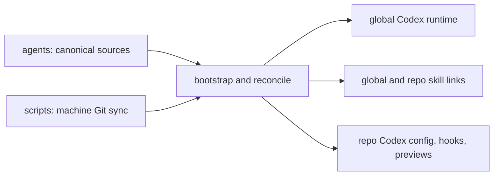

# Codex Control Plane

`~/GitHub/agents` is the canonical personal Codex control plane across both machines. Keeping it separate from runtime homes makes shared configuration reproducible without syncing credentials, conversations, caches, or private workspace data.

The source map is in [AGENTS.md](../../AGENTS.md). Standalone skills, native plugins, and standalone MCP definitions remain separate because their ownership and runtime scope differ; see [capability boundaries](capability-bootstrap-model.md).

## State and Authority

- `~/GitHub/agents` owns durable shared policy, source, registries, and renderers.
- `~/.agents/skills` is a thin discovery surface of generated links, not another source checkout.
- `~/.codex` holds applied config and app-owned runtime state. Preserve auth, sessions, databases, vendor imports, and caches according to their owner.
- Repo `.codex` files and managed skill links are rendered here; repo-owned source, local skills, and domain behavior stay in their repositories.
- `~/GitHub/scripts` owns machine bootstrap, scheduling, and Git transport. Public service wiring is separate from opt-in development previews.

Shared config establishes the baseline; exact trusted repository roots allow repo-local config to apply. Provider choice is machine-local, and model/effort/service-tier selection is client-owned. See [ownership](../references/codex-control-plane-ownership.md) for exceptions that sync must preserve.

## Applying Changes

Edit the canonical source and use the [shared bootstrap/check workflow](../references/agent-control-plane-operations.md). Machine Git sync carries changes to the other machine and invokes `auto-apply-agent-control-planes.sh`; machine-local stamps let it reconcile changed inputs. Offline machines catch up after the next successful sync.

Lifecycle automation publishes checked repository state; it does not build production applications in the Stop hook. Repo context and explicit finalization policy use the [lifecycle adapter contract](../references/repo-lifecycle-hook-adapter.md). Exact script order and flags live in executable source, while [Codex operations](../references/codex-control-plane-operations.md) retains useful recovery and runtime constraints.
