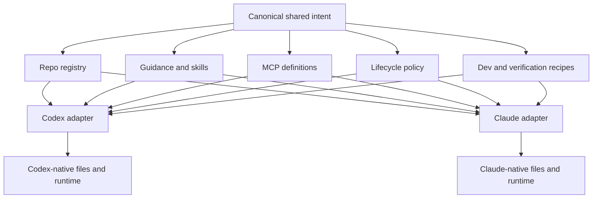

# Multi-Client Agent-Native Architecture Audit

Date: 2026-10-07

## Finding

The desired design is not a common runtime harness. Codex and Claude Code own
different agent loops, configuration schemas, permission systems, plugins, and
session stores. The durable shared layer is a control plane for intent:
repository identity, guidance, capabilities, lifecycle policy, and validation.
Each client then gets a thin native renderer and adapter.

This is also what the strongest historical implementation converged on. Claude
support was later removed as a product decision, not after evidence that the
architecture failed.



The boundary is deliberate: share the meaning, not the serialized files.

## What “Agent-Native” Should Mean Here

The reusable substrate is broader than prompt files:

1. **Authority and discovery** — an arriving agent can find the canonical
   instructions, code, owners, and validation commands without prior context.
2. **Portable capabilities** — skills and MCP servers are assigned by repository
   and made available through each client's native discovery paths.
3. **Deterministic enforcement** — hooks and Git checks enforce rules that must
   not depend on model memory or judgment.
4. **Executable completion** — agents can build, inspect, test, repair, and
   deliver within the repository's declared contract.
5. **Continuity** — projects, session handoff/finalization, and recovery state
   have explicit owners and resume points.
6. **Safe autonomy** — routine work is automated, but credentials, runtime
   history, user preferences, spending, and destructive actions keep their
   existing authority boundaries.
7. **Observable correctness** — bootstrap, check, and drift commands can explain
   the effective state for every repository and client.
8. **Recoverability** — generated outputs are ownership-marked, updates are
   idempotent, and removal affects only known managed material.

An `AGENTS.md` file alone makes a repository easier for an agent to understand;
the complete set above makes the repository reliably operable by agents.

## Historical Evidence

### First generation: sibling control planes

The April 2026 implementation used a full `claude/` sibling beside `codex/`.
Important convergence points were:

- `ad49a1cb`: one shared repo inventory and one neutral MCP registry;
- `76001f9c`: shared root bootstrap/check/reconcile;
- `04a51342`: shared multi-runtime hook registry;
- `97c6a67a`: normalized runtime hook payload adapter; and
- `38efcb9f`: removal of an early unified subagent registry after it proved too
  ambitious for the then-current need.

The old project record explicitly chose `AGENTS.md` as canonical repository
guidance, Claude compatibility imports, shared skill/MCP/repo registries, and
native per-client outputs without forcing false parity.

Commit `460ca305` removed this first implementation under the message “Make
agent control plane Codex-only.”

### Second generation: consolidated renderer

Claude was reintroduced in June 2026 with a leaner integration. The mature state
immediately before final retirement is `d216ee40`:

- `scripts/sync-claude.py` rendered guidance, skills, settings, hooks, MCP, and
  preview files from shared registries;
- `config/claude-settings.json` was a narrow Claude-specific overlay;
- `enabled_clients` and `model_instructions_clients` allowed repository-specific
  client selection;
- MCP schema v2 supported repository-by-client targets;
- the hook registry carried shared event intent plus per-runtime matchers; and
- focused tests covered ownership-preserving merges, pruning, guidance, skills,
  MCP, hooks, trust, and previews.

Commit `a9bb8c7c` removed the mature renderer and client dimensions, simplified
MCP and hooks to Codex, and introduced `scripts/retire-agent-clients.py`.
Commit `7aaa743c` removed the tracked generated Claude surfaces. The archived
record at
`bad2bb6b:docs/projects/archive/codex-only-control-plane/` states that this was
explicitly authorized, removed 141 installed paths with backups, and preserved
65 Codex outputs byte-for-byte.

The lesson is not to revert. The historical renderers encode old schemas,
Copilot/Antigravity complexity, broad permissive settings, Desktop preferences,
provider wrappers, and session jobs that are not part of the present request.

## Current Evidence

### Canonical and live state

- Current source checkout: `~/GitHub/agents`, remote
  `AdithyanI/agents`, commit `ad4702e4` when audited.
- Stale second source checkout: `~/.agents`, remote
  `wisdom-in-a-nutshell/.agents`, commit `6accc7ca` when audited.
- Current Claude Code: `2.1.220` from the Homebrew cask.
- Current shared catalog: 31 declared repositories, 44 managed standalone
  skills, 9 managed plugin-derived skill links, 20 declared unmanaged
  repo-local skills, 5 MCP definitions, 18 Codex plugins, 2 Codex hooks, and 9
  preview/action groups.
- Current machine: 19 declared repositories are present as Git repositories;
  12 declared paths are absent. Sparse machines are already an accepted
  contract, so absence is not evidence that an entry is stale.
- `modal_functions` is present but intentionally excluded from automatic
  enrollment because WIN owns its active implementation.

### Active hazards

`scripts/bootstrap-machine-agent-control-planes.sh` invokes
`scripts/retire-agent-clients.py` before every normal sync. The check path also
requires that the retirement migration find no managed non-Codex setup.

On the audit date, a dry run reports:

```text
UPDATE /Users/adi/.claude.json
REMOVE /Users/adi/GitHub/adi/.claude/settings.local.json
PENDING: 2 retired-client setup change(s)
```

The project-local file contains a current Claude permission entry. Claude Code
documents `.claude/settings.local.json` as the user-owned location where saved
project approvals are written. A future bootstrap must never prune that file.

The stale `~/.agents` checkout is a second authority hazard. Its old scripts and
configs are executable even though current documentation says that path is only
a thin runtime location for generated skill links.

The machine Git sync currently calls managed-repo enrollment after syncing this
control plane. That enrollment scans the live GitHub tree. If the registry is to
be deliberate policy, this path should report discoveries for review instead of
silently making the current directory tree authoritative.

Removal from the registry is not yet a complete inverse operation. The excluded
`modal_functions` checkout still has generated `.codex/config.toml`,
`.codex/hooks.json`, and the shared `core.hooksPath`; the non-Git
`whos-in-your-head` remnant still has broken managed skill links. Client support
should therefore use an explicit ownership manifest or equivalent reconciliation
record so disablement and de-enrollment can clean only outputs the control plane
actually created.

## Capability Seam Map

| Capability | Shared canonical intent | Codex native output | Claude native output | Current gap |
| --- | --- | --- | --- | --- |
| Repository identity | Stable ID, enrolled checkout path, enabled clients | Repo `.codex` config selection | Claude project selection | Inventory is inside `codex/`; IDs and symmetric client selection are absent |
| Global guidance | `config/global.agents.md` | `~/.codex/AGENTS.md` | Managed content at `~/.claude/CLAUDE.md` | Claude output absent; shared source still contains some Codex-only wording |
| Project guidance | Repo `AGENTS.md` hierarchy | Native `AGENTS.md` discovery | Native `AGENTS.md` on Claude `>=2.1.277`; compatibility import only below that floor | Installed Claude is `2.1.220` |
| Skills | `skills-source/` plus `skills/registry.json` scope and assignments | `~/.agents/skills` and repo `.agents/skills` | `~/.claude/skills` and repo `.claude/skills` symlinks | Claude renderer absent; per-client compatibility is undeclared |
| MCP | Neutral definitions and repo assignments | `[mcp_servers.*]` in Codex TOML | `.mcp.json` for shared project scope; `~/.claude.json` only for intentional personal scope | Current renderer and schema are Codex-only |
| Lifecycle hooks | Logical event, repository scope, timeout, normalized payload | Codex `hooks.json` and Codex payload adapter | `hooks` in Claude settings and Claude payload adapter | Validator/runtime accept only Codex; Stop implementation is Codex-specific |
| Git delivery | Shared hook path and repo-owned checks | Existing shared Git hooks | Same shared Git hooks | Already portable; conversation-end attribution is not |
| Runtime settings | Client-specific owned overlay | Codex TOML templates | Ownership-aware merge into `~/.claude/settings.json` and shared project settings | Claude overlay/renderer absent; current retirement touches local settings |
| Plugins | Capability identity only when useful | Codex native plugin registry/cache | Claude marketplaces/plugins | Must remain separate unless a component is explicitly promoted to a standalone skill or MCP |
| Subagents | Optional role purpose, scope, and access intent | Codex-native role/config behavior | `~/.claude/agents` or repo `.claude/agents` Markdown | No current shared role registry; defer until a repeated role justifies it |
| Previews/actions | `dev-servers/registry.json` launch intent | `.codex/environments/environment.toml` | Only a current, verified Claude-native surface if still needed | Historical Claude launch rendering should not be assumed current |
| Session lifecycle | Completion/recovery policy | Codex App Server thread/turn adapter | Claude hook/transcript/session adapter | Cannot share attribution logic directly |
| Operations | Root apply/check/auto-reconcile | Active | Required sibling adapter | Root orchestration actively retires Claude today |
| Dashboard/audit | Effective repo × capability × client view | Codex view | Claude view | Client dimension was removed |

## Recommended Source Layout

Keep the present top-level domains and add a sibling client adapter. Avoid a
large relocation of working Codex code merely to make names visually symmetric.

```text
config/
  global.agents.md
repos/
  registry.json
skills/
  registry.json
skills-source/
mcp/
  config/presets.json
hooks/
  registry.json
  scripts/                 # normalized shared repo-hook entrypoints
dev-servers/
  registry.json
codex/
  config/                  # Codex-only templates and policy
  scripts/                 # Codex renderer and runtime adapters
claude/
  config/                  # narrow Claude-only settings/policy overlay
  scripts/                 # small focused renderers/checks
scripts/
  bootstrap-machine-agent-control-planes.sh
  auto-apply-agent-control-planes.sh
  check-agent-control-planes.sh
```

The repo registry should give every repository a stable ID and keep native
fields below client overlays. Capability registries should reference IDs rather
than path basenames. One possible shape is:

```json
{
  "id": "agents",
  "path": "~/GitHub/agents",
  "clients": {
    "codex": { "enabled": true, "config": {} },
    "claude": { "enabled": true, "config": {} }
  }
}
```

Client support has two independent axes: a repository declares which clients it
supports, while each machine declares or detects which supported clients are
installed and enabled. A missing optional client should be a clear skip, not a
validation failure. A configured required client should fail clearly when
absent.

The `~/GitHub` directory listing should feed a drift report that proposes
enrollment/removal; it should not silently define the managed set. This avoids
mistaking worktrees, recovery clones, sparse machines, and transient directories
for policy.

## Renderer Rules

### Guidance

- Keep repo `AGENTS.md` files canonical.
- Set a minimum Claude version of at least `2.1.277` and use its native
  `AGENTS.md` discovery. This also preserves nested `AGENTS.md` loading without
  generating mirrors.
- Until the installed client meets that floor, either upgrade before the pilot
  or generate a clearly owned `.claude/CLAUDE.md` containing `@../AGENTS.md` as
  a temporary compatibility output.
- Render global shared guidance to `~/.claude/CLAUDE.md`. Prefer an owned copy or
  other form that remains valid across intended Claude surfaces; current Claude
  Cowork sessions can skip user-scope symlinks that resolve outside the working
  directory.
- Separate the genuinely shared global guidance from small client overlays. Do
  not put Codex runtime mechanics into Claude's global prompt.

### Skills

- Keep one skill directory per capability in `skills-source/`.
- Preserve global, repo, and dormant scopes.
- Render symlinks into each client's native discovery path. Claude officially
  supports symlinked skill directories but does not use `.agents/skills` as its
  documented project/personal location.
- Add explicit client compatibility when a skill relies on client-only tools or
  instructions. Portable Agent Skills can target both; native plugin skills stay
  with their plugin unless deliberately promoted.
- Reserve Claude's `synced` and `anthropic-skills` namespaces.

### MCP

- Keep one transport-neutral definition and one repo assignment.
- Compile it to Codex TOML and Claude `.mcp.json` separately.
- Add a client exception only when transport or availability genuinely differs;
  do not restore the old general-purpose three-client target matrix.
- Keep credentials in their runtime owner. Claude's `.mcp.json` supports
  environment expansion, while OAuth state remains outside the repository.
- Never rewrite the broader mutable `~/.claude.json` merely to provide project
  MCPs. Use its user/local scopes only when explicitly desired.

### Settings and permissions

- Treat `~/.claude/settings.json` as mutable user state and merge only a declared
  set of control-plane-owned keys.
- Use `.claude/settings.json` only for intentional shared project settings.
- Never manage or prune `.claude/settings.local.json`; Claude writes saved local
  approvals there.
- Keep model, effort, theme, UI choices, and credentials client-owned.
- Decide the permissive/bypass posture explicitly. Do not inherit the historical
  YOLO launcher or broad allow list merely because they existed.

### Hooks and completion

- Restore `claude` as a valid runtime in the logical hook registry and add a
  Claude renderer.
- Normalize native payloads before invoking repo-owned lifecycle scripts.
- Start with hooks whose meaning maps cleanly. Claude currently exposes
  `SessionStart`, `UserPromptSubmit`, `PreCompact`, `PostCompact`, `Stop`,
  `StopFailure`, `SessionEnd`, subagent events, and additional lifecycle events.
- Keep event support as a per-runtime capability table rather than pretending
  every event is universal.
- Do not point Claude Stop directly at the current Codex Stop path. Codex uses
  App Server thread/turn information and multi-repository transaction tracking;
  Claude supplies different session/transcript data.
- Until Claude-specific change attribution is proven, keep automatic
  commit/rebase/push on the Codex path only. Both clients may operate in one
  checkout, so “commit every dirty file in the current repo” is unsafe.

### Plugins and subagents

- Keep `plugins/registry.json` Codex-native.
- Introduce a Claude plugin registry only if actual installed packages need
  reproducible policy. Do not translate plugin bundles automatically.
- Model shared subagent roles only after concrete repeated use. If introduced,
  share the role's purpose, scope, and access intent, while keeping prompts,
  tools, models, permissions, hooks, and MCP fields in client-native overlays.

## Migration Sequence

1. Convert the client-retirement code from an unconditional steady-state check
   into archived/explicit migration behavior, retaining its backups and tests.
2. Establish `~/GitHub/agents` as the sole canonical source and safely reduce
   `~/.agents` to the runtime surface that current documentation promises.
3. Capture current Codex output fixtures and prove the registry move produces no
   unintended Codex changes.
4. Upgrade or otherwise satisfy the Claude version floor.
5. Implement focused Claude renderers for global guidance, skills, MCP, and
   ownership-aware settings. Avoid recreating the old monolith.
6. Apply only to `~/GitHub/agents`, inspect with Claude `/context`, `/skills`,
   `/mcp`, `/hooks`, and run a real task smoke test.
7. Add safe lifecycle adapters and test cross-client overlap before enabling
   Claude finalization.
8. Expand through the curated repo registry and then to the second machine.
9. Update the dashboard and durable architecture/operations docs after the
   implementation contract is proven.

## Validation Model

- Fixture tests for every renderer and ownership-preserving merge.
- Byte-for-byte or semantic baselines for unaffected Codex outputs.
- Dry-run, apply, check, and second-apply idempotence.
- Installed-client version/capability probes with actionable skips and failures.
- Real client smoke tests proving instructions, one global and one repo skill,
  one MCP, and each enabled lifecycle hook actually load.
- Negative tests proving credentials, sessions, unknown settings,
  `.claude/settings.local.json`, and hand-written files are preserved.
- Sparse-machine tests and exact repo-ID resolution.
- Concurrent Codex/Claude dirty-worktree tests before shared automatic delivery.
- Relevant repository fast checks, full control-plane tests, dashboard build, and
  runtime drift audit before rollout.

## Current Claude Facts Used By This Proposal

Official Claude Code documentation checked on 2026-10-07 states:

- Claude Code can read project and nested `AGENTS.md` directly starting in
  `2.1.277`, provided its built-in AGENTS plugin is enabled and project
  instruction selection permits it.
- Personal and project skills live at `~/.claude/skills/<name>/SKILL.md` and
  `.claude/skills/<name>/SKILL.md`; symlinked skill directories are supported.
- Settings precedence is managed, command-line, project-local, shared-project,
  then user. User, project, and project-local files are distinct ownership
  surfaces.
- Project MCP is stored in `.mcp.json`; user and local MCP state is stored in
  `~/.claude.json` with different scopes and precedence.
- Hooks can live in user, shared-project, project-local, managed-policy, plugin,
  skill, or subagent surfaces and merge across settings levels.
- User subagents live in `~/.claude/agents/`; project subagents live in
  `.claude/agents/`; their native fields exceed what Codex maps directly.
- Claude plugins can package skills, agents, hooks, and MCP servers, but are a
  client-native distribution unit with their own install scopes.

Sources:

- <https://code.claude.com/docs/en/memory>
- <https://code.claude.com/docs/en/skills>
- <https://code.claude.com/docs/en/settings>
- <https://code.claude.com/docs/en/hooks>
- <https://code.claude.com/docs/en/mcp>
- <https://code.claude.com/docs/en/sub-agents>
- <https://code.claude.com/docs/en/plugins>

## Historical Recovery References

Use these as evidence and extraction sources, not as branches to revert:

```bash
git show d216ee40:scripts/sync-claude.py
git show d216ee40:hooks/scripts/claude_stop.py
git show d216ee40:mcp/control_plane.py
git show d216ee40:hooks/control_plane.py
git show d216ee40:config/claude-settings.json
git show d216ee40:tests/control_plane/test_claude.py
git show bad2bb6b:docs/projects/archive/codex-only-control-plane/evidence.md
git show bad2bb6b:docs/projects/archive/codex-only-control-plane/learnings.md
```

The reusable assets are the shared-intent model, ownership-aware merge/prune
patterns, normalized hook boundary, client gates, and tests. The stale runtime
policy should be redesigned against the current installed client and official
documentation.
